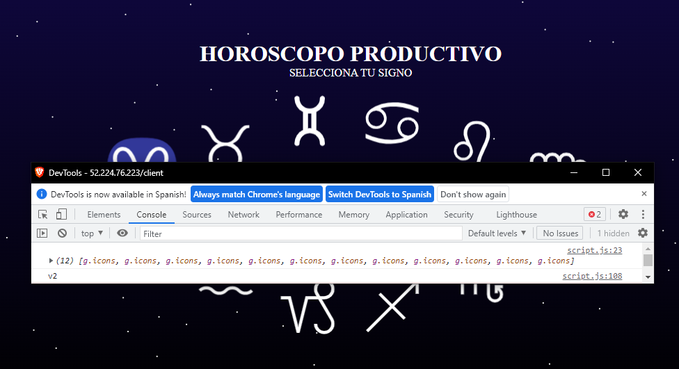

# Universidad de Guadalajara CUCEI 

## Proyecto Final para la materia computacion Tolerante a fallas

### Realizado por:

Jonathan Isaac Garcia Huerta

### LIVE DEMO: 
http://52.224.76.223/client
 
(hasta: 04/06/2023)

# Horoscopo Productivo

English: [README.md](Readme_EN.md)

Usualmente cuando se desarrolla cualquier aplicacion que necesite cualquier forma de programacion es necesario comprobar que esta aplicacion pueda seguirse ejecutando, puesto que por mas pruebas que se le puedan dar al software siempre podran salir errores que no se tienen contemplados, y para esto es necesario implementar las herramientas necesarias para poder que aunque salgan errores o fallas en un servicio poder garantizar el funcionamiento constante.

## Instalacion

Para poder realizar la ejecucion de este proyecto es necesario tener:

### Prerequisitos
1. Docker
2. Kubernetes cluster (Cloud / Local)
3. Kubectl
4. Isioctl
    1. Grafana
    2. Kiali
    3. Prometheous
    4. Jaeger
5. Node.js

### Subir al cluster
Para tener en el kluster de k8s la aplicacion solo es necesario aplicar todos los yaml
``` 
kubectl apply -f <Directorio del proyecto>
```
o aplicar cada uno manualmente como
``` 
kubectl apply -f <file>.yaml
```
y para obtener la direccion IP donde esta hosteado simplemente se verifican en los servicios el external IP:
```
kubectl get svc istio-ingressgateway -n istio-system 
```
en caso de tener \<pending> en la asignacion de la EXTERNAL-IP con minikube es necesario tener en otra terminal ``minikube tunnel``

con esto se puede ver las 4 partes que conforman el horoscopo productivo
## Contenido
Para la el proyecto es una pagina web simple que muestra horoscopos, que en vez de ser lo tipico realizado al azar, este horoscopo lo que realiza es una recomendacion que puedes tener al dia dependiendo de la fecha actual, donde en el LIVE DEMO sera cambiando la seed del random para que cambie cada mininuto el dia 29 de mayo para la presentacion de este mismo, pero los cambios de semilla deben ser cada dia en vez de cada minuto.
La forma en la que se obtienen los horoscopos es por medio de una API, la cual esta conectada a una "Base de datos", pero para poder realizar la prueba en un equipo con recursos limitados se realizo en una base de datos JSON solo para tener un nodo base de datos para las pruebas posteriores de lo tolerante a fallas.

### Pagina web (HoroscopeDeploy / HoroscopeMirror)
Para la pagina simplemente es un sitio web estatico que muestra los 12 signos del zodiaco, donde al pulsar cualquiera de estos da un horoscopo.


Al cambiar a cualquiera de los otros signos del zodiaco realiza otra recomendacion.


Donde como este es donde se tiene que realizar la mayor cantidad de datos al ser el que tiene que enviar todos los archivos necesarios termina siendo el de mayor peso para el envio de datos.


 asi que por esto mismo la pagina esta divida en 2, lo que es HoroscopeDeploy y HoroscopeMirror, y en un efecto de tener la pagina web hecha desde un http-server en vez de realizarlo en un framework, en envio de archivos esta divido entre los 2 servicios, y el unico que identifica de que pod vienen es script.js que manda en consola dependiendo de donde viene, siendo v1 para Deploy y v2 para Mirror, y se puede observar desde la consola.
 
 donde para poder comparar esto con recargar la pagina sin CACHE es posible ver que en algunos casos la consola varia entre v1 y v2, siendo que la probabilidad de cargar desde deploy o mirror es del 50%.

 ### API (HoroscopeAPI) y DB (HoroscopeBD)
 Para el caso de la api es bastante simple puesto que lo unico importante es tener en cuenta es que la api se encarga de generar la semilla para obtener un horoscopo para cualquiera de los signos y la base de datos tienen todos los horoscopos, donde la prueba para cada uno teniendo su redireccion como se muestra en las proximas imagenes:
 
 API
 


 DB
 


### Istio Kiali Dashboard
Puesto asi observamos las conexiones en el dashboard kiali simplemente llamandolo con
```
istioctl dashboard kiali
```
y en el apartado de los grafos podemos contemplar las conexiones y como se han realizado cada una de estas.


## Conclusión
La computacion tolerante a fallas es algo completamente necesario para poder asegurar que un servicio se mantiene activo asi como las herramientas necesarias para poder desarrollar sobretodo actualmente donde es necesarias las arquitecturas de mircroservicios para poder asegurar una disponibilidad en cualquier aplicacion donde los cambios solo afecten a una sola zona y poder realizar modificaciones o mantenimientos sin necesidad de afectar la totalidad del sistema, o el solo hecho de poder realizar deploys en entornos aislados que aseguran poderse ejecutarse igual en cualquier maquina, o inclusive las inclusiones de diversos dashboards que permiten observar el trafico y poder ver si algun servicio o parte de la aplicacion falla poder saber en que parte se originan los problemas. siendo todo esto principalmente los trabajos necesario que debe de poder realizar DevOps como minimo.
