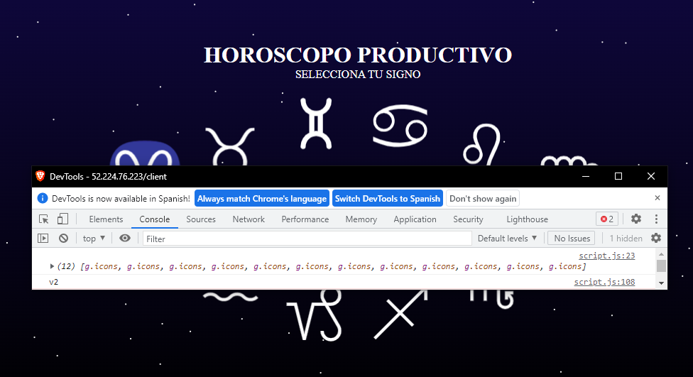

# Productive Horoscope

## LIVE DEMO:
http://52.224.76.223/client
 
(valid until: 06/04/2023)

Español: [README.md](README.md)

## Installation

In order to run this project, you need to have the following:

### Prerequisites
1. Docker
2. Kubernetes cluster (Cloud / Local)
3. Kubectl
4. Isioctl
    1. Grafana
    2. Kiali
    3. Prometheus
    4. Jaeger
5. Node.js

### Deploying to the cluster
To deploy the application on the Kubernetes cluster, you simply need to apply all the YAML files:
``` 
kubectl apply -f <Clone Dir>
```
or apply each one manually:
``` 
kubectl apply -f <file>.yaml
```
To obtain the IP address where it is hosted, you can check the external IP in the services:
```
kubectl get svc istio-ingressgateway -n istio-system 
```
If you have `<pending>` in the EXTERNAL-IP assignment with minikube, you need to run `minikube tunnel` in another terminal.

This will set up the four components that make up the productive horoscope.

### Webpage (HoroscopeDeploy / HoroscopeMirror)
The webpage is a static website that displays the 12 zodiac signs, and when you click on any of them, it provides a horoscope.

Switching to any other zodiac sign shows a different recommendation.


Since this part requires the most data as it needs to send all the necessary files, it has the highest data transfer weight.

To manage this, the webpage is divided into two parts: HoroscopeDeploy and HoroscopeMirror. It emulates a webpage hosted by an http-server instead of using a framework. The file transfer is divided between the two services, and the only file that identifies where it comes from is script.js, which logs a message to the console based on the source. "v1" represents Deploy, and "v2" represents Mirror. You can observe this in the console.

By comparing this with reloading the page without caching, you can see that in some cases, the console logs either v1 or v2, indicating a 50% probability of loading from Deploy or Mirror.

### API (HoroscopeAPI) and DB (HoroscopeDB)
Regarding the API, it is quite simple, as the only important thing to consider is that the API generates a seed to retrieve a horoscope for any sign. The database stores all the horoscopes. The following images show the redirection for each of them:

API

DB


### Istio Kiali Dashboard
To observe the connections in the Kiali dashboard, simply run:
```
istioctl dashboard kiali
```
In the graphs section, you can see the connections and how each of them has been connect.


## Possible Ongoing Features

- [ ] 13th zodiac sign that throws containers
- [ ] Add the ability to add new horoscopes to the database
- [ ] Implement token authentication for accessing the API and database.